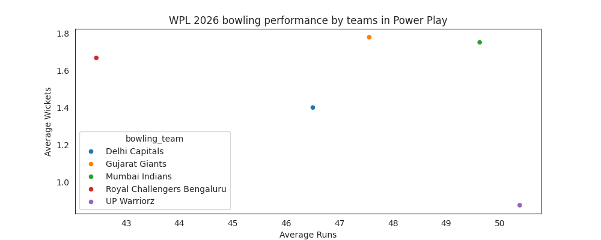
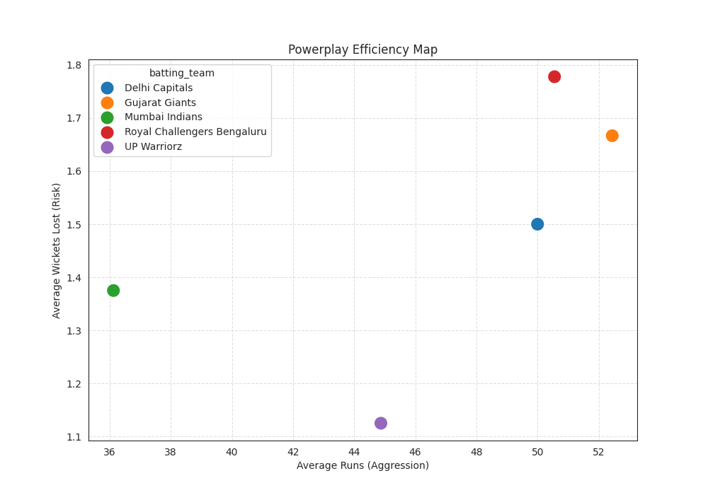
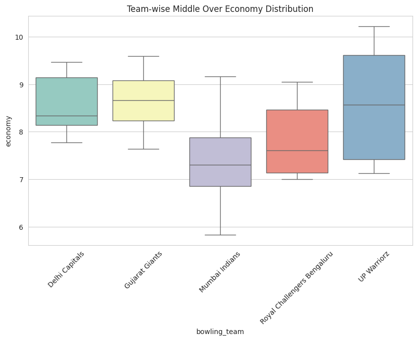
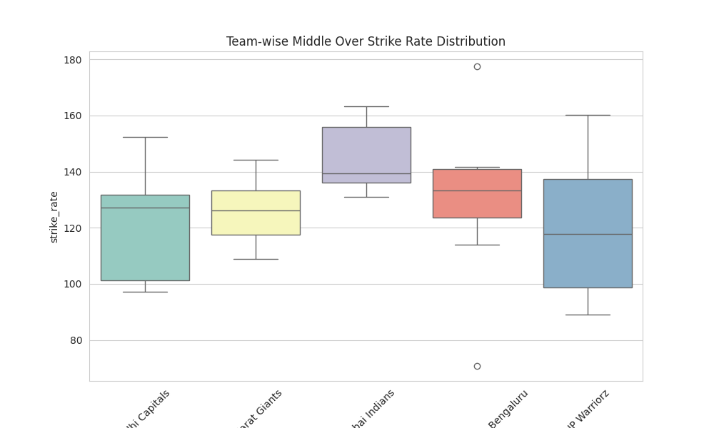
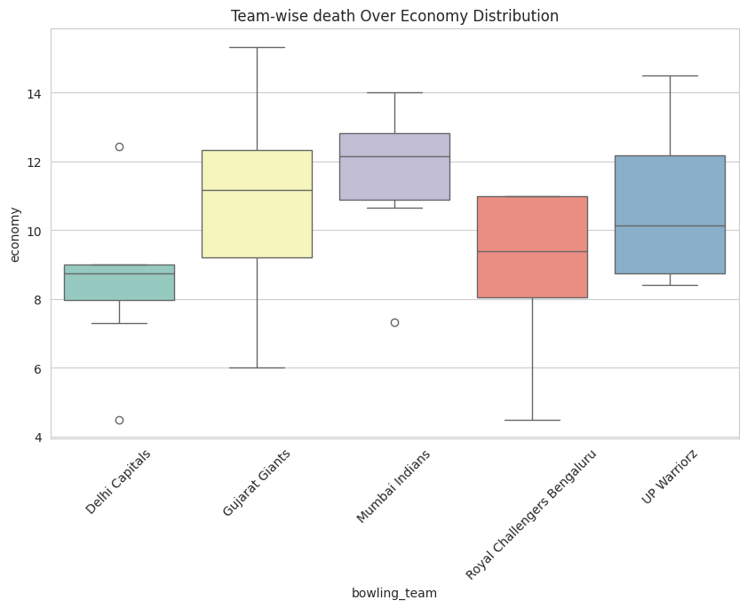
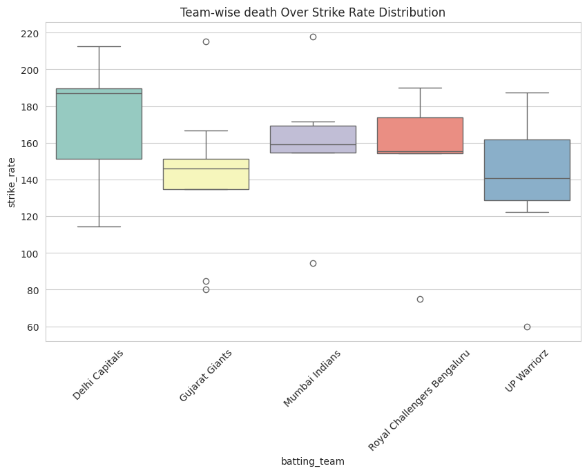

# 🏏 WPL 2026 Phase Analysis & Best Playing 11

## Project Overview
This document outlines the tactical phase-by-phase analysis of the Women's Premier League (WPL) 2026 season. By segmenting the match data into three critical phases—Powerplay, Middle Overs, and Death Overs—we aim to identify the most impactful players and ultimately determine the data-driven **Best Playing 11 of the Tournament**.

---

## 1. The Powerplay (Overs 1-6): Setting the Foundation
The Powerplay is defined by mandatory fielding restrictions, offering the highest probability for boundaries. Our analysis focused on the balance between run accumulation and wicket preservation. 

### Key Insights:
* Teams that maximized their Powerplay score (>45 runs) without losing more than 2 wickets consistently set up match-winning totals.
* Openers were evaluated on their ability to exploit fielding restrictions while maintaining a low dismissal rate.

**Visual Analysis:**

---

## 2. The Middle Overs (Overs 7-15): The Spin Paradigm
Once fielding restrictions are lifted, the game enters a consolidation phase where frontline spinners are typically introduced. Success here relies heavily on aggressive strike rotation rather than pure boundary hitting.

### Key Insights:
* The data highlights a pronounced dip in the tournament average run rate around overs 8-11.
* Middle-order batters who consistently found gaps and maintained a strike rate above 120 against spin were critical to their team's success.
* Spinners with an economy rate under 7.0 in this phase were flagged as highly valuable assets.

**Visual Analysis:**

*(Economy and Strike rate metrics during the middle phase.)*

---

## 3. The Death Overs (Overs 16-20): The Final Assault
The final five overs demand sheer power-hitting and strategic innovation. This phase heavily favors "impact finishers" who can strike at extreme rates, and specialist bowlers who can execute wide yorkers and variations.

### Key Insights:
* Players who struck at >160 SR in this phase drastically shifted the momentum and win probability.
* Bowlers who conceded fewer boundaries in overs 18-20 were crucial to defending targets.

**Visual Analysis:**

*(Caption: Quadrant Analysis of Impact Finishers - Strike Rate vs Total Runs in the Death Overs.)*

---

## 4. The Ultimate Playing 11
By aggregating the performance metrics across all three phases, we removed subjective bias to select the most lethal combination of players for the WPL 2026 season. The selection criteria heavily weighted:
1. Dominant Powerplay Openers.
2. Spin-adept Middle Order anchors.
3. High-Strike-Rate Death Over Finishers.
4. Economical phase-specialist Bowlers.

**The Final Team:**

---

## Technical Setup & Reproducibility
All plots and analyses were generated using Python (Jupyter Notebooks). 
To reproduce this analysis:
1. Clone the repository: `git clone https://github.com/MohanReddy05/wpl-2026-analysis.git`
2. Install dependencies: `pip install -r requirements.txt`
3. Run the analytical notebooks in the `notebooks/` directory.